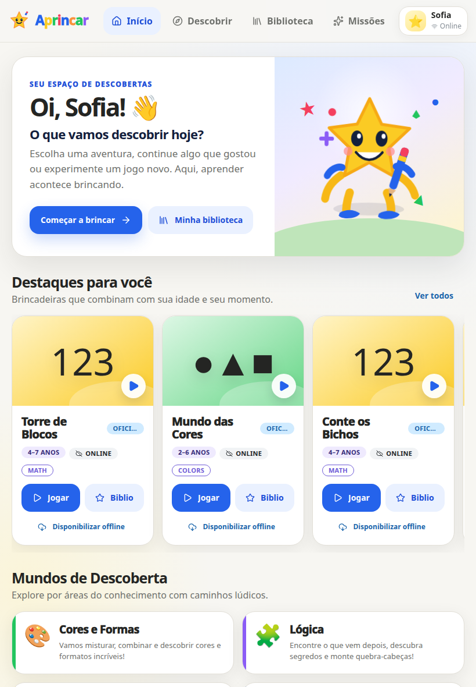

<p align="center">
  
</p>

<p align="center">
  <strong>Plataforma aberta, local-first e offline-first para experiências de aprendizagem por meio da brincadeira.</strong>
</p>

<p align="center">
  <a href="https://aprincar.github.io/platform/"><strong>Experimentar o beta</strong></a>
  ·
  <a href="https://github.com/aprincar/platform/releases/tag/v1.0.0">Release v1.0.0</a>
  ·
  <a href="docs/README.md">Documentação</a>
  ·
  <a href="CONTRIBUTING.md">Contribuir</a>
</p>

## Estado atual

A base técnica da **V1.0.0** está publicada e validada. O produto já pode ser explorado como beta, com aplicação web/PWA, Hub, armazenamento local, progresso, Skill Graph, runtime de extensões e distribuição dos jogos oficiais.

O catálogo de jogos oficiais está entrando em uma sprint própria de **hardening de experiência, precisão pedagógica e confiabilidade**. A plataforma pode ser testada agora, mas os jogos ainda não devem ser tratados como conteúdo pedagógico final.

<p align="center">
  
</p>

## Para quem chegou agora

### Quero experimentar

Abra **https://aprincar.github.io/platform/**.

O beta foi desenhado para funcionar no navegador e manter a experiência principal local-first. Problemas de navegação, instalação, progresso ou runtime devem ser reportados neste repositório; problemas específicos de jogos oficiais pertencem ao [aprincar/games-official](https://github.com/aprincar/games-official).

### Quero rodar localmente

Requisitos:

- Node 22+
- npm 10+

```bash
git clone https://github.com/aprincar/platform.git
cd platform
npm install
npm run dev
```

Para o Hub:

```bash
npm run dev:hub
```

Validação completa:

```bash
npm run check
```

## O que existe neste repositório

- aplicação principal React/PWA;
- Hub standalone;
- núcleo local-first;
- GameHost e sandbox de extensões;
- Aprincar SDK;
- Evidence Ledger e Progress Engine;
- Skill Graph;
- armazenamento, sync e políticas de capabilities;
- pipeline de distribuição dos jogos oficiais.

Jogos são extensões web e **não são importados pela aplicação React**.

## Modelo de runtime

`Registry → ExtensionManager → local cache/remote → sandboxed GameHost → MessageChannel SDK → Evidence/Storage/Rewards`

O artefato V1 de uma extensão é um `game.html` autocontido acompanhado de `manifest.json`. Um jogo pode ser criado com Vite, React, Phaser, Three.js ou qualquer tecnologia de navegador que produza esse contrato.

O GameHost controla as capacidades disponíveis para cada extensão. Jogos não recebem acesso direto ao IndexedDB da aplicação, DOM do responsável, PIN, perfil completo ou APIs privilegiadas.

## Contratos de produto

Algumas regras são intencionais e não devem ser quebradas por conveniência de implementação:

- evidence não é mastery;
- recompensas não determinam progresso pedagógico;
- BNCC é ligada ao Skill Graph, nunca diretamente ao jogo;
- permissões sensíveis são default-deny;
- a criança não precisa de login obrigatório;
- o produto não usa anúncios infantis, loot boxes, FOMO ou moedas pagas.

A documentação canônica da organização está em [aprincar/.github](https://github.com/aprincar/.github).

## Documentação técnica

- [Índice](docs/README.md)
- [Arquitetura](docs/ARCHITECTURE.md)
- [Extensões](docs/EXTENSIONS.md)
- [Desenvolvimento](docs/DEVELOPMENT.md)
- [Operação](docs/OPERATIONS.md)
- [Organização GitHub](docs/GITHUB_ORGANIZATION.md)

## Contrato de versões

A V1 usa domínios de versão independentes:

- **Platform/package SemVer:** `1.0.0`
- **Extension Manifest Schema:** `manifestVersion: 1`
- **SDK wire protocol:** `PROTOCOL_VERSION = 1`

O SemVer dos pacotes não altera automaticamente o schema do manifest nem o protocolo do SDK.

O gate de release verifica uma única versão de plataforma em todos os workspaces e no lockfile:

```bash
npm run verify:release-version
```

O fluxo de produção também executa checks do repositório, formatação, auditoria de dependências de alta severidade, verificação do snapshot oficial e Playwright E2E antes da publicação de release.

## Próxima etapa

A próxima frente de produto não é ampliar o runtime: é melhorar o que a criança realmente joga. O trabalho imediato está concentrado no catálogo oficial, reduzindo complexidade, eliminando estados inconsistentes e validando desafio, resposta esperada e feedback jogo a jogo.

---

**Aprincar — Aprender acontece brincando.**
